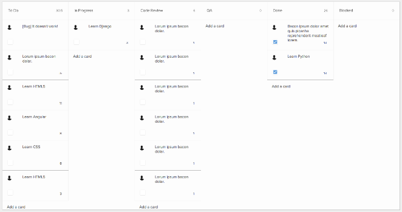
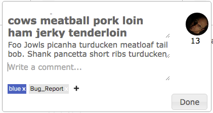

### Asana Scrum Boards

This is an alternative HTML5 Web front-end to Asana.  It allows you to view an Asana 
project as a scrum board.

The different sections on your Project will be used as columns on the scrum
board and each task will be placed as a card in the section's column.

On the main board, cards can be dragged between columns and re-ordered,  
task descriptions and point values can be edited and task assignee can be
changed by clicking the assignee icon.  In addition, pop-up window allows
you to view/edit other attributes of the task such as the full description,
comments and tags.

Story points are automatically retrieved from existing Asana tasks.  Any
number surrounded by [brackets] will be used as a point value.  When tasks
are saved back to asana the point values are placed at the start of the
task taitle surrounded by brackets.

A public demo of this Asana front-end is available here: https://hacks.chartbeat.com/asana

### History

We've been using Asana at Chartbeat the past couple of years for project and
task tracking.  It is a very flexible tracking system that allows you track
basic information about tasks and have conversations about them in one central
location.  As Asana puts it: "Keep conversations with tasks, instead of
scattered across email."  

Recently we started modifying our agile development process by adopting several
ideas from the Scrum framework.  This started to push the boundaries of what
Asana could do for us. Asana can track basic information about a task like a
short and longer description, task owner, due date and comments.  However, it
doesn't have very good support for a few parts of the Scrum framework like task
estimation and task progress.  If you're not familiar with Scrum see below for a
very short introduction.

So, we decided to see what we could do to make Asana work better for us. By
adopting a few standards we found places that we could put information critical
to Scrum and we created a small web application to provide some of the missing
Scrum artifacts like a planning board and burn down charts.

#### Estimates

Asana does not have a separate field for estimates so we choose to place task
estimates in the task title surrounded by brackets.  e.g "[3] This is a short
task".  This method is suggested by the Asana team and they've built a
little 'bracket hack' that will add up all the bracketed numbers for a group of
tasks you've selected (see https://twitter.com/asana/status/453940658915401728).

#### Projects

We used to use one Asana project for each product's tasks.  This worked well to
track and set priorities for all the projects tasks.  However, when it came to
sprint execution we wanted a way to focus on only the tasks at hand and view
the progress of those tasks.  So, we continued using the one project per
product for the product's backlog.  This project contains all the tasks
necessary to build the project in priority order.  The highest priority at the
top and the lowest at the bottom. Then, during sprint planning we create a new
project for the sprint backlog and move or add tasks to the sprint project. 
In Asana, if you click and drag a task in to another project you "move" it. If
you edit the task you add it to additional projects
(see https://asana.com/guide/help/tasks/projects.)

In the sprint backlog project we started using asana 'Sections' to show what
state the task is in.  Example sections are 'To Do', 'In Progress', 'Review', 'QA',
'Done'.  During the sprint we move the task from the 'To Do' section to 'In
Progress', etc... as the task progresses through the development pipeline.  We
decided that the sections in the sprint backlog would be ordered from most
complete at the top to least at the bottom.  This allows you to organize the
tasks in priority order with the highest at the top.  Then, tasks bubble up to
the top as work on them progresses.  Here's an example project:

    Done:
    [5] Bacon ipsum dolor amet cupim turducken bacon biltong pork belly doner. 
    [3] Boudin meatball kevin corned beef landjaeger turducken pastrami porchetta prosciutto ball tip meatloaf kielbasa. 

    QA:
    [8] Kevin pork chop alcatra brisket. 

    In Progress:
    [3] Prosciutto frankfurter ground round, bacon tenderloin corned beef picanha shoulder ribeye sausage hamburger meatball. 
    [3] Chuck pancetta swine brisket filet mignon kevin flank meatball fatback pastrami chicken venison alcatra. 

    To Do:
    [5] Venison frankfurter salami beef. 
    [2] Brisket tongue ball tip, pig strip steak andouille pancetta porchetta flank shank ham hock cow beef ribs chuck.


#### Asana Scrum Application

Asana's list oriented structure is great for certain Scrum activities like back
log planning.  You can easily move tasks up and down a list to change their
priority and easily pick out a set of tasks.  However, it falls short for use
in sprint execution.  It's definitely usable but doesn't give a good
visualization of progress of tasks in the sprint.  Also, while Asana does have
a 'Progress' graph it is only task based and not story value based.  

Our company works in six week cycles which are split into two week sprints.  At
the end of each cycle we break out of our usual routines and work on whatever
we want.  We call this time "hackweek."  

During one hackweek I built a small proof of concept scrum board.  It is
a web application that uses the Asana APIs to present tasks in an Asana project
on a Scrum Planning Board. During our next hackweek cycle we started working on
hack teams.  I recruited a few people to move the boards forward.  We
implemented most of the features you need to maintain tasks during a sprint and
created a cumulative flow chart.

The basic planning board shows all tasks for a project laid out like note cards
on a wall. The board is split up into columns where each column represents a
different state the task can be in (to do, in progress, done.)   Cards can be
moved from column to column to progress them through the workflow. The columns
are defined by the Sections in the Asana project.  



__Sample Scrum Board__

Each card on the board contains a high level summary of task.  Here, you will
find the task name, point value, assignee and whether or not the task is
completed.  You can zoom in on a card to see additional Asana information like
full description, comments and tags.



__Full Scrum Card__

If you currently use Asana you can use our app to view your project.  Just
navigate over to our hackweek server: https://hacks.chartbeat.com/asana.  Even
if you don't use Asana you can take a look at a sample board on the link.  It
shows the basic functionality although there's no actual Asana project hooked
up to the cards.

We've open sourced the code for this project and you can fork it yourself at
the Chartbeat Labs GitHub repo: https://github.com/chartbeat-labs/asana-scrum-board

#### Future Ideas

We often break tasks into smaller sub-tasks.  It is very difficult to see the
progress of those sub-tasks and we'd like to address this in a future version
of the app.  For now, we have a simple (or convoluted) work-around for this. 
In Asana, sub-tasks can also be added to projects and they will show as
top-level tasks.  When creating a sprint project, I go into each sub-task and
add it to the sprint project.  This makes the top level task and sub-tasks
appear alongside each other.  So, I usually create a 'High Level Tasks' or
'Sprint Goals' section at the bottom of the Project and move the top-level
tasks into that section.  Now, we can move sub-tasks through the workflow
individually.

One important idea of Scrum is to identify and remove all blockers for a task. 
We would like to add a visual indicator to show which cards are blocked.  

### Very Short Explanation of Scrum

Scrum is an agile framework for managing a process.  It relies on self
organizing, cross functional teams to do the work. During the process the team organizes work
into small well defined tasks.  Tasks are organized into a "Product Backlog"
which is an ordered list of tasks required to create a product.  Work on the
tasks is done in equal length "Sprints" which are typically one to four weeks
in length.  

At the start of each sprint the team takes items from the top of the Product
Backlog to build a Sprint Backlog.  These are the tasks they commit to
completing during the sprint.  Items on the Product Backlog may be very high
level or very specific.  However, for an item to be brought into a sprint it
needs to have an estimate (provided by the team) and an acceptance criteria or
definition of "done".

Each day of the sprint the team comes together in a daily standup to
communicate task progress.  Each member of the team gives a short summary of
what they did yesterday, what they will do today and if there is anything
blocking progress on the task at hand.  Teams often do this stand up in front
of the Scum Board which is a white board or wall containing cards for each task
in the sprint.  The cards are organized into columns which show the progress of
the task from ready to work on to completed ('To Do', 'In Progress', 'Done').

At the end of the sprint the team comes together to demo what they've
completed during the sprint and finally to discuss the "Process" in what is
called a Sprint Retrospective.

The players of the Scrum team are the Product owner, the Scrum Master and the
developers/testers.  The Product owner is responsible for maintaining the
product backlog, providing priority and knowledge about tasks.  The Scrum
Master helps the team with the scrum process and works to remove any blockers. 
The developers/testers are the people building the product.  Usually the team
consists of five to nine people. 

More info: https://www.mountaingoatsoftware.com/agile/scrum

### Local Installation

#### Running with Django

Inside the asana directory, run:

```
python manage.py runserver
```

From a brower, browse to http://127.0.0.1:8000/static/boards/index.html

#### Non Django Setup

Alternately, django is not really required.  All the files in 
asana/boards/static/boards can be placed on a web server and run from there.  

#### Asana Setup

To setup Asana access, create a new `App` in your Asana Profile Settings.
Use the location of the `index.html` file for the *App URL* and the
location of `login.html` for the *Redirect URL*.  Change index.js to include 
the Client ID and redirect URL as defined by the new App.

You can override the default client_id/redirect_uri by settings the following
localStorage values in the javascript console:


  localStorage.asanaClientId = your_client_id;
  localStorage.asanaRedirectUri || 'https://your_redirect_url/login.html';
